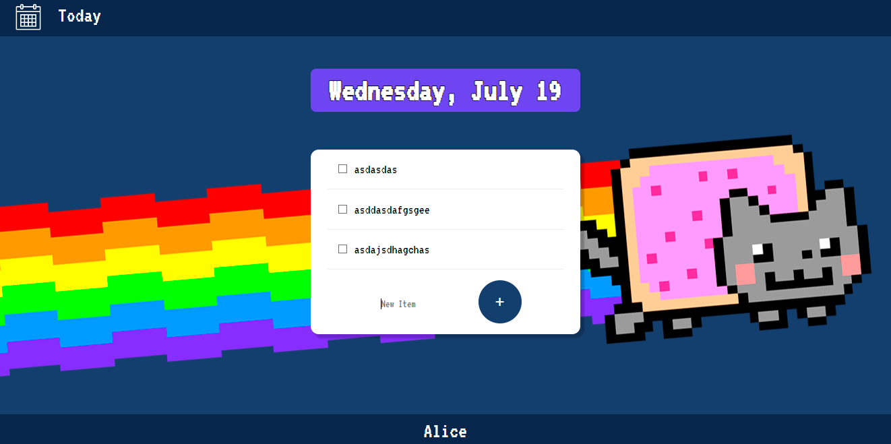

# To Do List

## Project Description

- The goal of this project is to create a ToDo List web application using Node.js, Express.js, EJS, MongoDB and Mongoose. The application will allow users to create and view tasks. Tasks will persist between sessions, a database will be used in this version of the application. Styling will be an important aspect of this project to ensure a good user experience.

## Features

1. Task Creation: Users should be able to create new tasks.

2. Task Viewing: Users should be able to view a list of all their tasks.

3. Tasks Saving and Delete: Tasks are save on a database and can be deleting.

4. Task Completing: Users should be able to strike through their completed tasks in the todo list.
